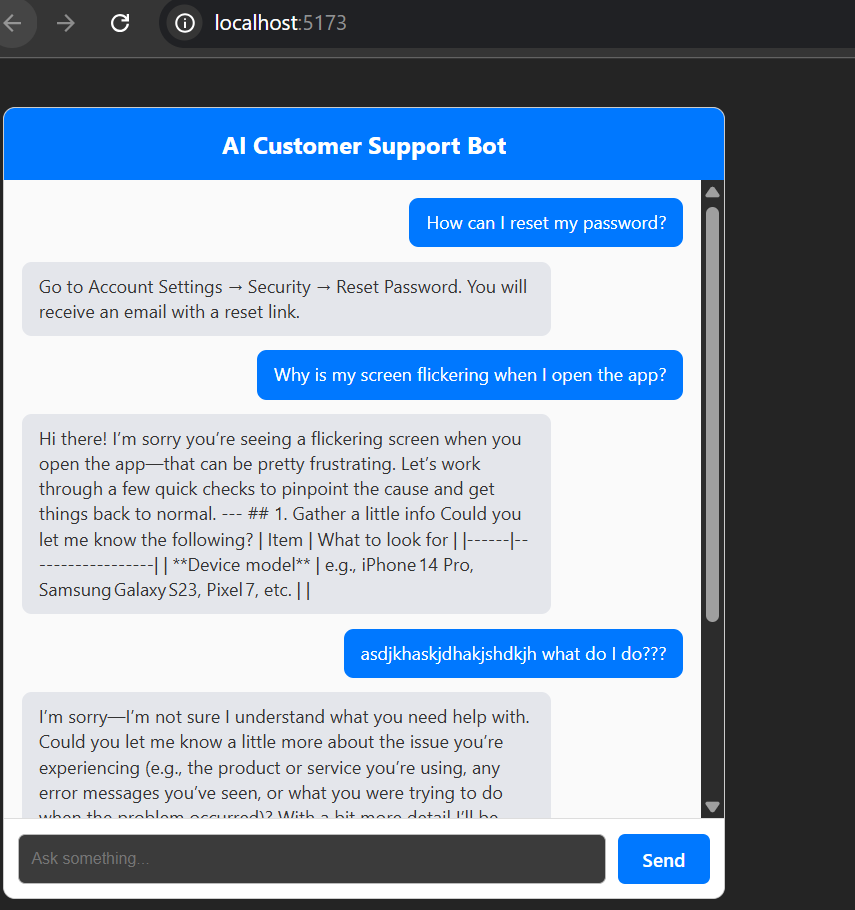

🤖 AI Customer Support Bot

A smart, LLM-powered customer support system that answers FAQs, maintains conversation context, escalates unresolved queries, and provides a simple chat interface.
This project was created for the Placement Drive Assignment.

🚀 Features

🔹 1. AI-Powered Responses

Uses Groq LLM (openai/gpt-oss-120b) for intelligent, contextual replies when FAQs are not sufficient.

🔹 2. FAQ Matching (Semantic Search)

Retrieves the best matching FAQ from MongoDB

Falls back to AI when similarity is low

Uses embedding-based similarity + word-overlap fallback

🔹 3. Contextual Memory

A session stores:

User messages

Bot messages

Summary (optional)

Allowing the bot to remember past messages during the session.

🔹 4. Escalation System

If the bot cannot answer after repeated attempts or FAQ similarity is too low →
👉 The query is automatically escalated and stored in DB for review.

🔹 5. Clean REST API

Well-structured backend with:

Controllers

Services

Models

Validators

Error handling

Logging

🔹 6. Simple React Chat UI

A clean chat interface built with React + Axios.

🏗️ Tech Stack

Backend

Node.js

Express.js

MongoDB + Mongoose

Groq SDK (LLM)

Zod Validation

Dotenv

CORS

Frontend

React

Axios

UUID

📁 Project Structure

backend/
├── src/
│ ├── controllers/
│ ├── models/
│ ├── services/
│ ├── routes/
│ ├── validators/
│ ├── utils/
│ └── app.js
├── seed/
│ └── insertFaqs.js
└── package.json

client/
├── src/
│ ├── components/
│ ├── api/
│ └── App.jsx
└── package.json

⚙️ Installation & Setup

1️⃣ Clone the repository

git clone <repo-url>
cd backend

2️⃣ Install backend dependencies

npm install

3️⃣ Add environment variables

Create .env inside backend:

PORT=5000
MONGODB_URI=mongodb://localhost:27017/ai-customer-support-bot

GROQ_API_KEY=your_groq_api_key_here
GROQ_MODEL=openai/gpt-oss-120b
GROQ_EMBEDDING_MODEL=llama-embed-english-v1

FAQ_MATCH_THRESHOLD=0.6
FAQ_ESCALATION_THRESHOLD=0.2

4️⃣ Seed FAQs into MongoDB

node seed/insertFaqs.js

5️⃣ Run backend

npm run dev

6️⃣ Run frontend

cd ../client
npm install
npm run dev

📡 API Endpoints

POST /api/query

Send a user message.

Request:

{
"sessionId": "abc123",
"query": "How do I reset my password?"
}

Response:

{
"success": true,
"botResponse": "Go to Account Settings → Security → Reset Password...",
"matchScore": 0.92,
"usedFAQ": true,
"escalated": false
}

🖼️ Screenshots

<!-- Add your screenshots here -->

(Placeholder: Chat UI Screenshot)
(Placeholder: API Testing Screenshot)
(Placeholder: MongoDB Collections Screenshot)

🔮 Future Scope

⭐ 1. Dynamic FAQ Management

Admin dashboard where FAQs are:

Added

Edited

Deleted

Automatically embedded for semantic search

⭐ 2. Neural Search with Vector Database

Replace word-overlap fallback with:

Pinecone

Weaviate

Milvus

⭐ 3. Personalized Customer Accounts

Allow customers to:

Log in

Access previous conversations

Save preferences

⭐ 4. Real Order Tracking Integration

Connect chatbot to:

Order database

Shipping partners

Live delivery status

⭐ 5. Analytics Dashboard

Track:

Top customer queries

Escalation rate

FAQ effectiveness

⭐ 6. Multi-language Support

Use LLM translation models to support 10+ languages.

📌 Author

Developed as part of the Placement Drive Assignment.
Includes AI-powered customer support pipeline with modern backend & frontend technologies.
